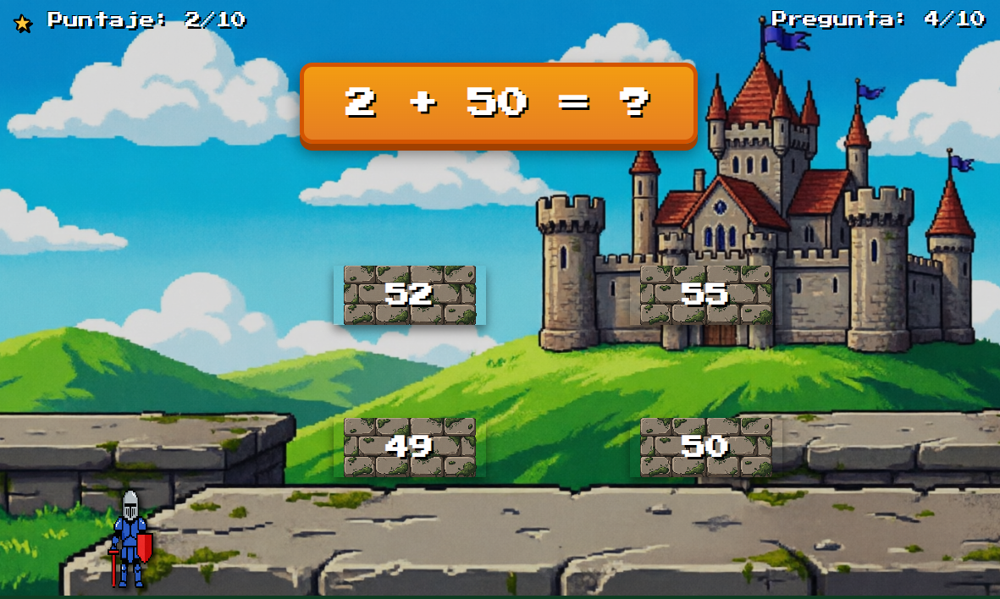

# 🎮 ARITMAT+ - Aventura Matemática

*¡Salta, resuelve operaciones matemáticas y aprende jugando!*

 

<!-- Video de demostración -->
<video src="banner/ARITMAT+ - Aventura Matemática.mp4" width="100%" controls autoplay loop muted></video>

---

## 📖 Sobre el Proyecto
**ARITMAT+** es un juego de plataformas educativo diseñado para desafiar tu agilidad mental. El jugador debe navegar a través de un mundo dinámico donde cada decisión cuenta: para avanzar, deberás resolver operaciones matemáticas en tiempo real y aterrizar sobre la plataforma correcta.

---

## 🎯 Características Principales
- **Aprendizaje Activo:** Combina la adrenalina de los juegos de plataformas con el desafío de las matemáticas.
- **Dinámica Única:** Resolución de problemas mediante mecánicas de movimiento.
- **Acceso Directo:** Jugabilidad simple e intuitiva: *¡Solo apunta y resuelve!*

---

## 🚀 Especificaciones Técnicas

| Categoría | Detalle |
| :--- | :--- |
| **Género** | `Platformer` / `Educativo` / `Arcade` |
| **Tecnologías** | HTML5 Canvas, CSS3, JavaScript (Vanilla) |
| **Asistencia IA** | Optimización de física y colisiones |

---

## 🧠 Desarrollo y Futuro

### Lo que logré implementar:
- 🏗️ **Física Base:** Gravedad, saltos precisos y sistema de colisiones.
- 🕹️ **Gestión de Estados:** Transición fluida entre Menú, Juego y Game Over.
- 📈 **Sistema de Puntuación:** Registro de aciertos y progreso.

### Próximos pasos:
- 🔊 **Integración de Audio:** Efectos de sonido para saltos y resultados.
- 🎨 **Pixel Art:** Mejora estética de personajes y escenarios.
- 📊 **Dificultad:** Escalado de niveles y nuevas operaciones matemáticas.

---

[⬅️ Volver al Portafolio Principal](../README.md)

