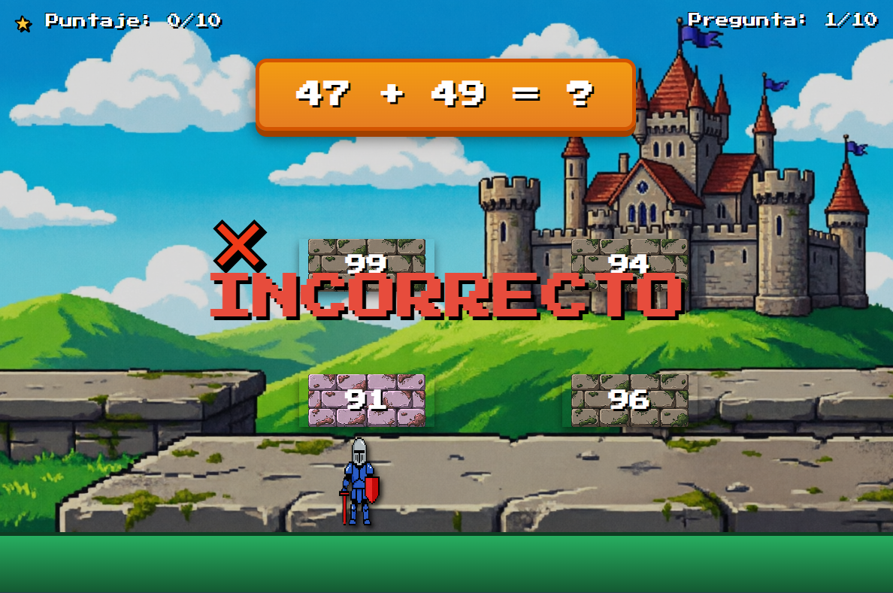
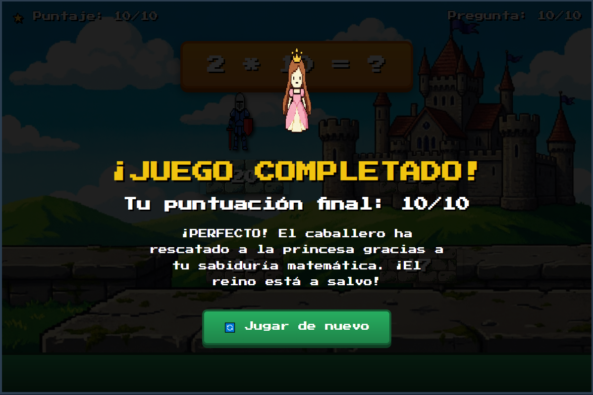
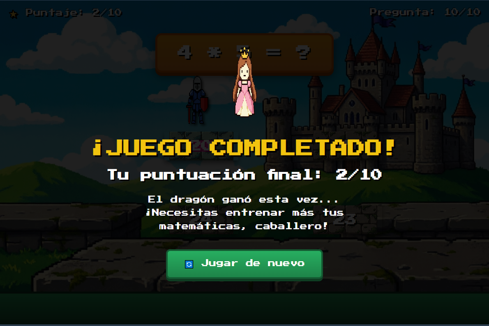

# 🎮 ARITMAT+ - Aventura Matemática

## Descripción

**ARITMAT+** es un juego de plataformas educativo que combina la aventura de un caballero con el desafío de las matemáticas.

### ¿De qué trata?
Un valiente caballero debe rescatar a una princesa atrapada en una torre. Para avanzar y demostrar su sabiduría, debe resolver operaciones matemáticas en tiempo real, seleccionando la plataforma correcta entre varias opciones.

### ¿Cuál es el objetivo del jugador?
Responder correctamente 10 operaciones matemáticas (suma, resta, multiplicación y división) seleccionando con el mouse la plataforma que contiene la respuesta correcta. El objetivo es obtener la mayor puntuación posible para rescatar exitosamente a la princesa.

### ¿Cuál es la mecánica principal?
- Aparece una operación matemática en la parte superior de la pantalla
- Cuatro plataformas muestran diferentes respuestas posibles
- El jugador debe **hacer clic en la plataforma con la respuesta correcta**
- El caballero salta automáticamente hacia la plataforma seleccionada
- Feedback visual inmediato: ✅ verde si es correcto, ❌ rojo si es incorrecto
- Sistema de puntuación: 1 punto por cada respuesta correcta (máximo 10/10)

## Género

**Platformer** / **Educational** / **Arcade**

## Controles

| Acción | Método |
|--------|--------|
| **Seleccionar respuesta** | Click del mouse en la plataforma |
| **Mover el cursor** | Mouse |

> **Nota:** El juego se juega **exclusivamente con el mouse**. No requiere teclado.

## Capturas de pantalla

### Pantalla inicial / Gameplay

*El caballero debe seleccionar la plataforma con la respuesta correcta*

### Demo del juego

*Resolución de operaciones matemáticas en tiempo real*

### Respuesta incorrecta

*Feedback visual cuando se selecciona una plataforma incorrecta*

### Pantalla de victoria

*Pantalla final al completar las 10 preguntas con buena puntuación*

### Pantalla de derrota

*Pantalla final cuando la puntuación es insuficiente para rescatar a la princesa*

## Características Técnicas

- **10 preguntas** generadas aleatoriamente
- **4 operaciones**: suma (+), resta (-), multiplicación (×), división (÷)
- **4 plataformas** de respuesta por pregunta
- **Sistema de puntuación**: 0-10 puntos
- **Feedback visual**: Animaciones y colores para respuestas correctas/incorrectas
- **Múltiples finales**: Diferentes mensajes según la puntuación obtenida

## Tecnologías

- HTML5
- CSS3
- JavaScript (Vanilla)
- Google Fonts (Press Start 2P)

---

**Desarrollado por:** [@goemon043](https://github.com/goemon043)

*¡Demuestra tu habilidad matemática y rescata a la princesa!*
