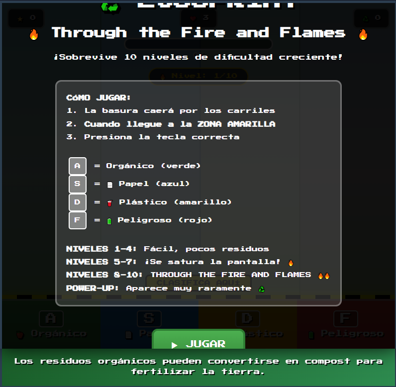
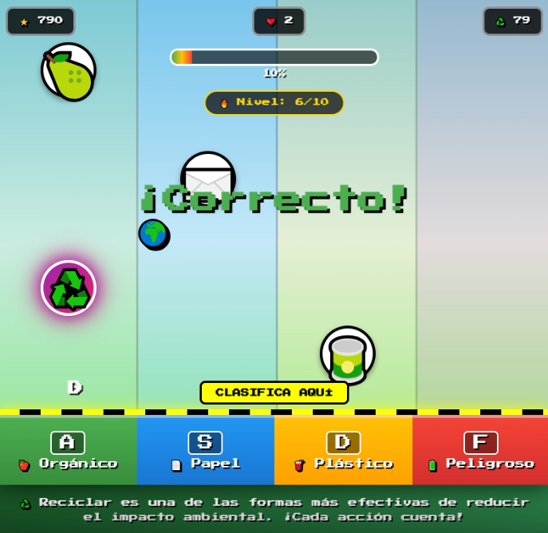
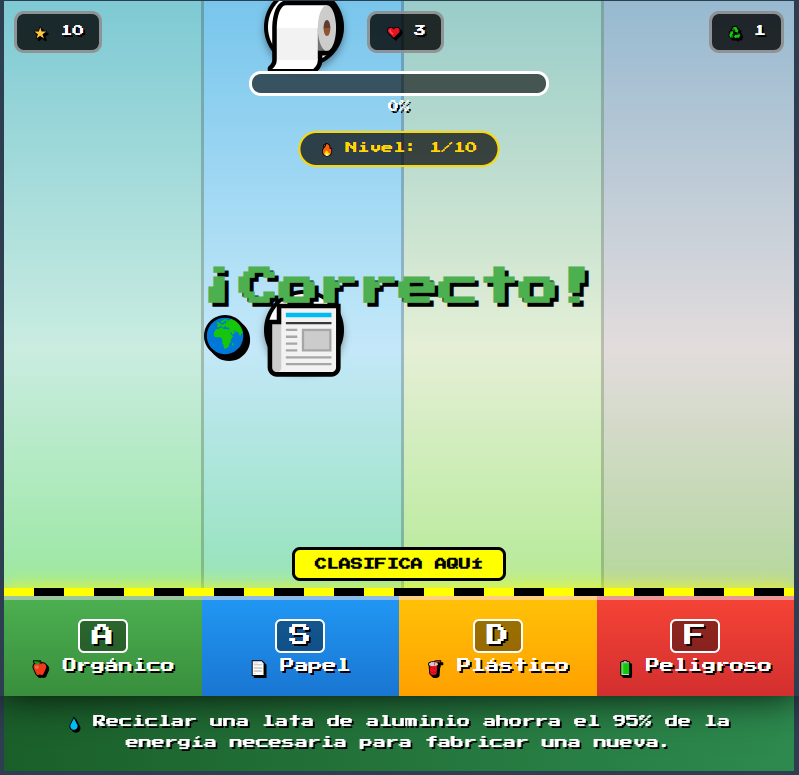
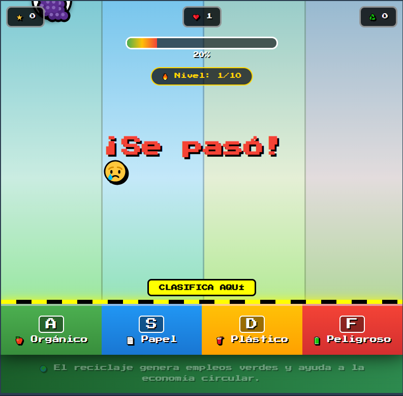
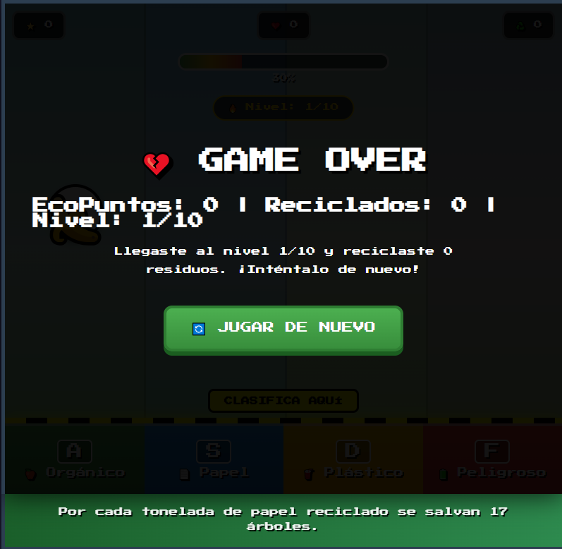

# ♻️ ECOSPRINT - Through the Fire and Flames

## Descripción

**EcoSprint** es un juego de arcade educativo de clasificación de residuos que pone a prueba tus reflejos y conocimientos sobre reciclaje.

### ¿De qué trata?
El jugador debe clasificar correctamente diferentes tipos de residuos que caen por 4 carriles antes de que lleguen al suelo. Cada residuo debe ir al contenedor correspondiente: Orgánico (verde), Papel (azul), Plástico (amarillo) o Peligroso (rojo). A medida que avanzas, la dificultad aumenta drásticamente hasta llegar al temido nivel 10: "Through the Fire and Flames".

### ¿Cuál es el objetivo del jugador?
Sobrevivir 10 niveles de dificultad creciente clasificando correctamente al menos 15 residuos por nivel. El jugador debe mantener sus 3 vidas, minimizar la contaminación y obtener la mayor puntuación posible mientras aprende datos importantes sobre reciclaje.

### ¿Cuál es la mecánica principal?
- **4 carriles de caída**: Los residuos aparecen aleatoriamente en los carriles
- **Zona de clasificación amarilla**: Cuando el residuo llega a esta zona, se ilumina la tecla correspondiente
- **Clasificación con teclado**: Presionar A, S, D o F según el tipo de residuo
- **Sistema de vidas**: 3 vidas, se pierde una por cada error o residuo que toca el suelo
- **Barra de contaminación**: Aumenta con los errores
- **Power-ups**: Aparecen raramente y activan reciclaje automático por 5 segundos
- **Progresión de niveles**: 
  - Niveles 1-4: Fácil (2-3 residuos máx)
  - Niveles 5-7: Difícil (5-6 residuos, velocidad alta)
  - Niveles 8-10: THROUGH THE FIRE AND FLAMES (7-10 residuos, velocidad extrema)

## Género

**Arcade** / **Educational** / **Action**

## Controles

| Tecla | Acción |
|-------|--------|
| `A` | Clasificar en contenedor Orgánico (verde) 🍎 |
| `S` | Clasificar en contenedor Papel (azul) 📄 |
| `D` | Clasificar en contenedor Plástico (amarillo) 🥤 |
| `F` | Clasificar en contenedor Peligroso (rojo) 🔋 |

> **Nota:** Debes presionar la tecla cuando el residuo esté en la **zona amarilla de clasificación**.

## Capturas de pantalla

### Menú principal

*Pantalla de inicio con instrucciones y botón de jugar*

### Gameplay

*Residuos cayendo por los 4 carriles con la zona de clasificación amarilla*

### Demo del juego

*Clasificación de residuos en tiempo real con aumento de dificultad*

### Respuesta correcta

*Feedback visual verde cuando se clasifica correctamente*

### Respuesta incorrecta / Fallo

*Feedback visual rojo cuando se clasifica en el contenedor equivocado*

### Game Over

*Pantalla final mostrando puntuación, nivel alcanzado y residuos reciclados*

## Características Técnicas

- **10 niveles** de dificultad progresiva
- **4 tipos de residuos**: Orgánico, Papel, Plástico y Peligroso
- **Emojis universales** para cada tipo de residuo
- **Sistema de puntuación**: 10 puntos por acierto
- **Barra de contaminación**: Aumenta 10-15% por error
- **Power-ups**: Reciclaje automático por 5 segundos (aparecen cada 40-60 segundos)
- **Panel de mensajes educativos**: Rotación de 20 datos sobre reciclaje
- **Feedback visual**: Flashes de color en carriles correctos/incorrectos

## Tipos de Residuos

| Tipo | Emoji | Carril | Tecla | Ejemplos |
|------|-------|--------|-------|----------|
| **Orgánico** | 🍐🍌🥕 | 1 | `A` | Frutas, verduras, cáscaras |
| **Papel** | 📄📰📦 | 2 | `S` | Periódicos, cajas, cartón |
| **Plástico** | 🧽🍶🎲 | 3 | `D` | Envases, botellas, juguetes |
| **Peligroso** | 🔋🩹⚠️ | 4 | `F` | Pilas, medicamentos, aceite |

## Tecnologías

- HTML5
- CSS3 (con animaciones y gradientes)
- JavaScript (Vanilla)
- Google Fonts (Press Start 2P)

---

**Desarrollado por:** [@goemon043](https://github.com/goemon043)

*¡Aprende a reciclar mientras sobrevives al caos!*

### 🌍 Mensajes Educativos

El juego incluye 20 datos importantes sobre reciclaje que se muestran durante el gameplay:
- Tiempo de degradación de materiales
- Impacto ambiental del reciclaje
- Consejos prácticos de separación
- Estadísticas de contaminación
- Beneficios del reciclaje

---

*Through the Fire and Flames - DragonForce 🎸*
