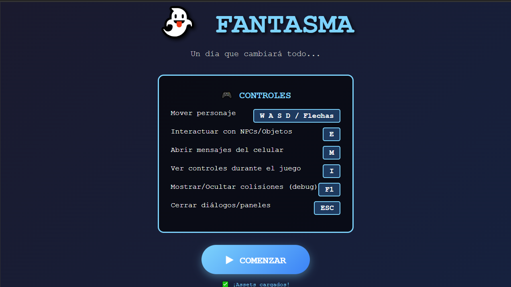
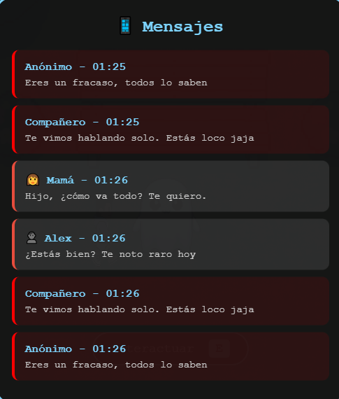
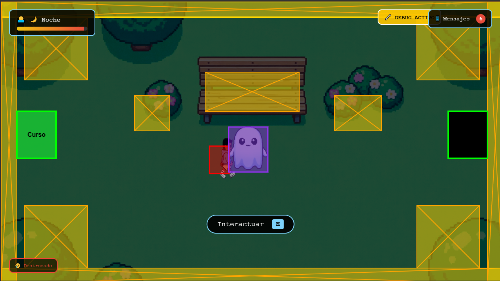
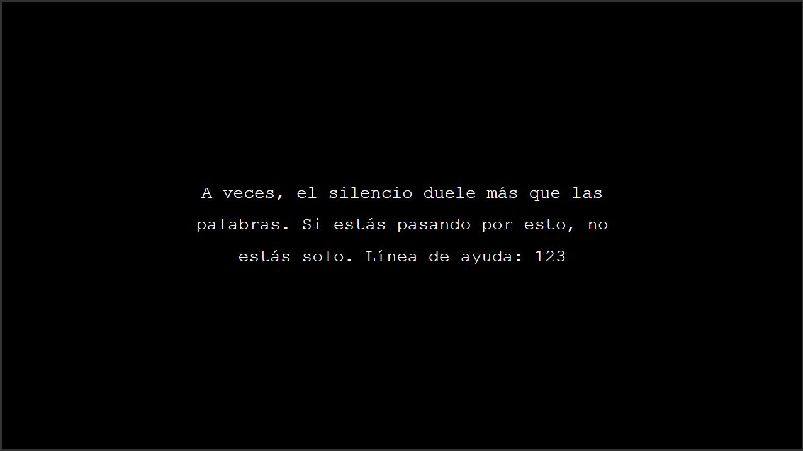

#  FANTASMA

## Descripción

**FANTASMA** es un juego narrativo de exploración 2D que aborda el tema del acoso escolar (bullying) y el ciberbullying desde una perspectiva emocional e introspectiva.

### ¿De qué trata?
El jugador asume el papel de un estudiante sin nombre que sufre acoso escolar. A lo largo de un solo día en la escuela, un fantasma misterioso aparece como guía emocional, representando la parte de él que aún quiere luchar. El jugador debe decidir si se aísla o busca ayuda, interactuando con compañeros, profesores y familiares mientras enfrenta mensajes de ciberbullying en su celular.

### ¿Cuál es el objetivo del jugador?
Navegar por los 4 escenarios de la escuela (Aula, Biblioteca, Patio y Cuarto), interactuar con los NPCs para construir una red de apoyo, y manejar los mensajes de ciberbullying de manera saludable. El objetivo final es llegar al final del día con suficiente confianza para obtener el mejor final posible.

### ¿Cuál es la mecánica principal?
- **Exploración libre** entre escenarios conectados
- **Sistema de diálogos** con decisiones que afectan el estado emocional del personaje
- **Minijuego de ciberbullying**: mensajes acumulativos tipo notificaciones que el jugador debe leer y responder
- **Sistema de confianza oculto** (0-100) que afecta la velocidad del personaje, los diálogos del fantasma y el final del juego
- **Fantasma interactivo** con conversaciones contextuales según el estado del jugador
- **Ciclo día/noche** que avanza con el tiempo de juego (~10 minutos)
- **3 finales diferentes** según las decisiones tomadas

## Género

**Adventure** / **Narrative** / **Educational**

## Controles

| Tecla | Acción |
|-------|--------|
| `W A S D` / `Flechas` | Mover personaje |
| `E` | Interactuar (NPCs, fantasma, salidas) |
| `M` | Abrir panel de mensajes del celular |
| `I` | Ver controles durante el juego |
| `F1` | Mostrar/ocultar modo debug (colisiones) |
| `ESC` | Cerrar diálogos y paneles |

## Capturas de pantalla

### Menú principal

*Pantalla de inicio con los controles del juego*

### Demo del juego

*Gameplay mostrando la exploración y mecánicas del juego*

### Sistema de mensajes

*Panel de mensajes del celular con notificaciones de bullying*

### Modo debug

*Visualización de colisiones y hitboxes con F1*

### Final malo

*Pantalla final cuando la confianza es muy baja*

## Sistema de Finales

El juego tiene **3 finales** según las decisiones del jugador:

| Final | Color | Requisito |
|-------|-------|-----------|
| 🌟 **Bueno** | Blanco | Confianza ≥ 70 Y 6-8 objetivos |
| 😐 **Regular** | Gris | Confianza ≥ 40 O 3-5 objetivos |
| 💔 **Malo** | Negro | Confianza < 40 Y < 3 objetivos |

## Características Técnicas

- **4 escenarios**: Aula, Biblioteca, Patio y Cuarto con transiciones día/tarde/noche
- **4 NPCs**: Alex, Sam, Profesor Martín y Mamá (cada uno con 2 tareas)
- **Sistema de mensajes**: 70% probabilidad de bullying, 30% de apoyo
- **Fantasma consciente**: Reacciona contextualmente a las decisiones del jugador
- **Velocidad variable**: El personaje camina más lento cuando está triste
- **Sonido de notificación**: Generado con Web Audio API al recibir mensajes
- **Fallback visual**: Si los assets no cargan, el juego dibuja gráficos simples

## Tecnologías

- HTML5 Canvas
- CSS3 (con animaciones y gradientes)
- JavaScript (Vanilla)
- Web Audio API (sonidos de notificación)

---

**Desarrollado por:** [@goemon043](https://github.com/goemon043)

**Música:** Blue and Sentimental (NPO) - Viktor Kraus / Count Basie Orchestra

*Si estás pasando por una situación de acoso, recuerda: no estás solo. Pedir ayuda es un acto de valentía.*

---

### 💭 Mensaje del Juego

El juego busca transmitir que:
1. **No estás solo** — Siempre hay alguien dispuesto a ayudarte
2. **Pedir ayuda es de valientes** — No es debilidad, es coraje
3. **El aislamiento empeora todo** — Hablar con alguien es el primer paso
4. **El ciberbullying es real** — Los mensajes duelen y tienen consecuencias
5. **Hay salida** — No importa qué tan oscuro parezca el día, mañana puede ser mejor

---

*🎯 Objetivos: 8 tareas | 💬 Mensajes: 70% bullying |  Fantasma: Tu guía emocional*
