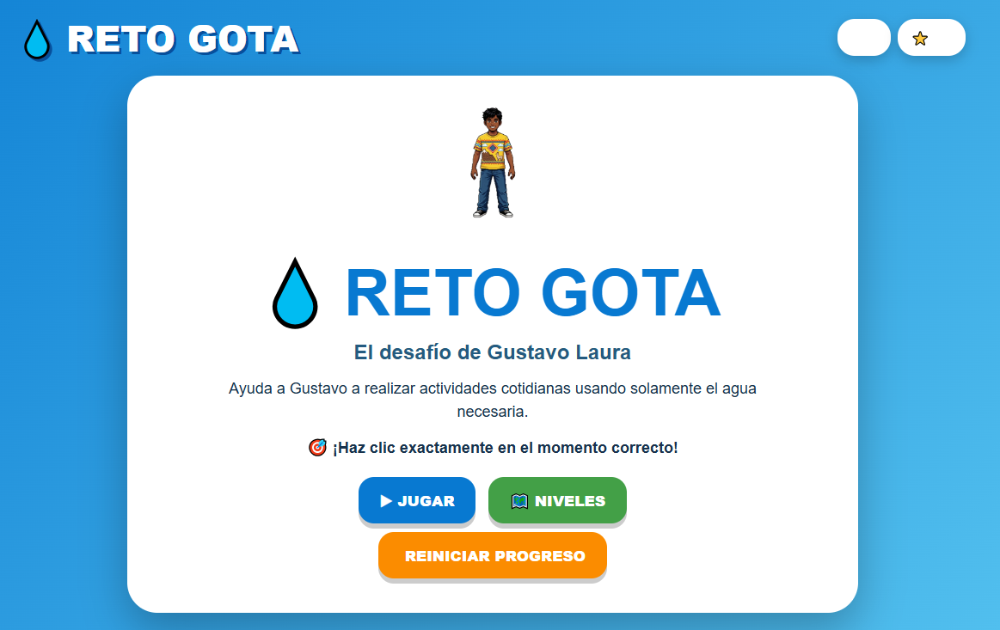
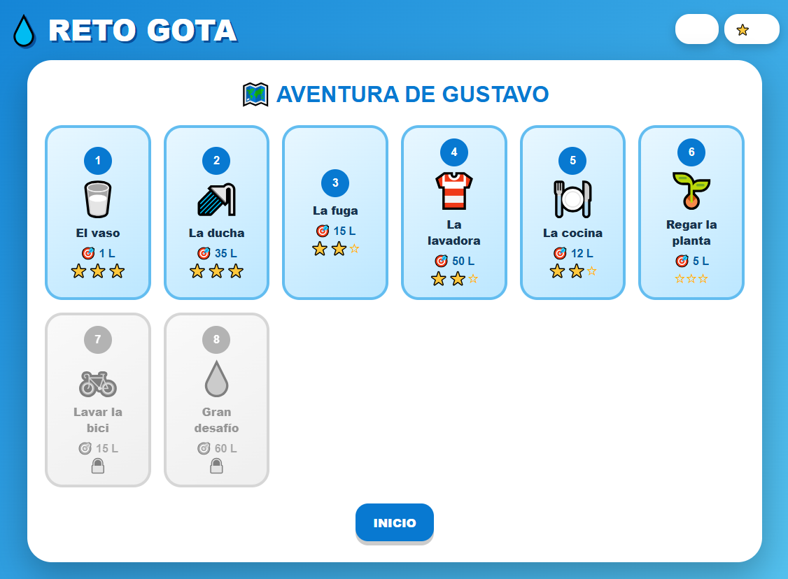
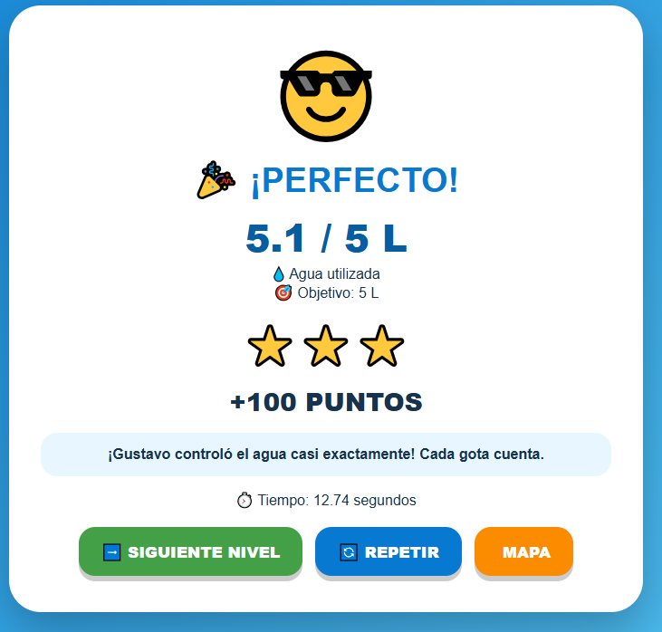
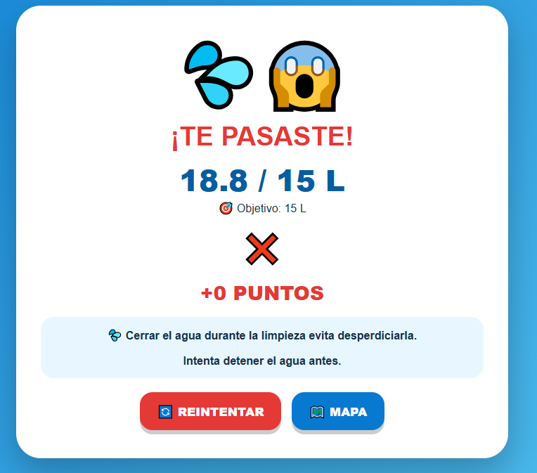

# 💧 RETO GOTA - El Desafío de Gustavo Laura

## Descripción

**Reto Gota** es un juego educativo de precisión que enseña sobre el uso responsable del agua a través de situaciones cotidianas.

### ¿De qué trata?
Gustavo Laura debe realizar 8 actividades diarias (desde llenar un vaso hasta lavar la bicicleta) utilizando exactamente la cantidad necesaria de agua. El agua comienza a fluir automáticamente y el jugador debe detenerla en el momento preciso para no desperdiciar ni usar de más. Cada nivel representa una situación real donde el consumo consciente del agua es importante.

### ¿Cuál es el objetivo del jugador?
Completar los 8 niveles deteniendo el flujo de agua exactamente cuando se alcance la cantidad objetivo mostrada en litros. El jugador debe desarrollar precisión y timing perfecto para obtener 3 estrellas en cada nivel, demostrando su habilidad para usar solo el agua necesaria.

### ¿Cuál es la mecánica principal?
- **Llenado automático**: El agua sube continuamente a diferentes velocidades según el nivel
- **Precisión milimétrica**: Detener el agua exactamente en el target de litros
- **Sistema de estrellas**:
  - ⭐⭐⭐ **Perfecto**: Dentro del 2% del objetivo (±0.02)
  - ⭐ **Muy bien**: Dentro del 8% del objetivo (±0.08)
  - ⭐ **Aceptable**: Entre 70-115% del objetivo
  - ❌ **Fallo**: Demasiada agua (>115%) o muy poca (<70%)
- **8 niveles progresivos**: Cada uno con velocidad y objetivo diferentes
- **Panel de progreso**: Muestra litros actuales, tiempo transcurrido y barra de progreso visual
- **Indicador de precisión**: Emoji que aparece en tiempo real (✅ perfecto, ⚠️ cerca)
- **Efectos visuales**: Gotas de agua cayendo, salpicaduras, partículas al ganar
- **Guardado de progreso**: Estrellas y puntos se guardan en localStorage

## Género

**Educational** / **Precision** / **Arcade** / **Casual**

## Controles

| Acción | Método |
|--------|--------|
| **Detener el agua** | Click del mouse o toque en pantalla en el botón "DETENER" |
| **Navegar menús** | Click en botones de interfaz |

> **Nota:** El juego se juega **exclusivamente con mouse o touch**. El timing es crucial.

## Capturas de pantalla

### Menú principal
  
*Pantalla de inicio con Gustavo y opciones de juego*

### Mapa de niveles
 
*Selección de los 8 niveles con sistema de estrellas desbloqueadas*

### Demo del juego
 
*Gameplay mostrando el llenado del contenedor y detención precisa*

### Victoria
 
*Pantalla de éxito al completar un nivel con 3 estrellas*

### Derrota / Te pasaste
 
*Pantalla de game over cuando se excede el límite de agua*

## Niveles del Juego

| Nivel | Actividad | Objetivo | Velocidad | Consejo |
|-------|-----------|----------|-----------|---------|
| **1** | 🥛 El vaso | 1 L | Lenta | Detén el grifo apenas tengas lo necesario |
| **2** | 🚿 La ducha | 35 L | Rápida | Una ducha corta ahorra mucha agua |
| **3** | 🔧 La fuga | 15 L | Media | Detectar fugas evita desperdicio |
| **4** | 👕 La lavadora | 50 L | Muy rápida | Carga bien organizada = menos agua |
| **5** | 🍽️ La cocina | 12 L | Media | Cierra el grifo mientras no usas agua |
| **6** | 🌱 Regar la planta | 5 L | Lenta | Las plantas no necesitan agua de más |
| **7** | 🚲 Lavar la bici | 15 L | Media | No mantengas la manguera abierta |
| **8** | 💧 Gran desafío | 60 L | Extrema | ¡Controla cada gota! |

## Características Técnicas

- **8 niveles** con escenarios únicos y backgrounds diferentes
- **Sistema de precisión**: Cálculo en tiempo real del porcentaje de exactitud
- **Progresión guardada**: Estrellas (0-3 por nivel) y puntos totales en localStorage
- **Efectos visuales**: 
  - Gotas de agua animadas cayendo
  - Salpicaduras al llenar
  - Partículas celebratorias al obtener 3 estrellas
  - Indicador de precisión en tiempo real
- **Barra de progreso**: Cambia de color según la precisión (azul → amarillo → verde)
- **Responsive**: Adaptable a diferentes tamaños de pantalla
- **Personaje animado**: Gustavo con animación de acción continua

## Sistema de Puntuación

| Precisión | Estrellas | Puntos | Mensaje |
|-----------|-----------|--------|---------|
| 98-100% | ⭐⭐⭐ | 100 pts | "¡Perfecto!" |
| 92-97% | ⭐⭐ | 70 pts | "¡Muy bien!" |
| 70-91% o 101-115% | ⭐ | 35 pts | "¡Lo lograste!" |
| <70% o >115% | ❌ | 0 pts | Game Over |

## Tecnologías

- HTML5
- CSS3 (con animaciones y gradientes)
- JavaScript (Vanilla)
- LocalStorage API (guardado de progreso)
- Canvas API (efectos de partículas)

---

**Desarrollado por:** [@goemon043](https://github.com/goemon043)

**Personaje principal:** Gustavo Laura

*¡Cada gota cuenta! Aprende a usar el agua responsablemente.*

---

### 🌍 Mensaje Educativo

El juego enseña 8 situaciones cotidianas donde podemos ahorrar agua:
- Usar solo el agua necesaria en cada actividad
- Cerrar el grifo mientras no se usa
- Detectar y reparar fugas
- Duchas más cortas
- Riego eficiente de plantas
- Lavado consciente de ropa y objetos

---

*💧 Objetivo: 35 litros | ⏱️ Precisión: 0.02s |  8 niveles de conciencia ambiental*
