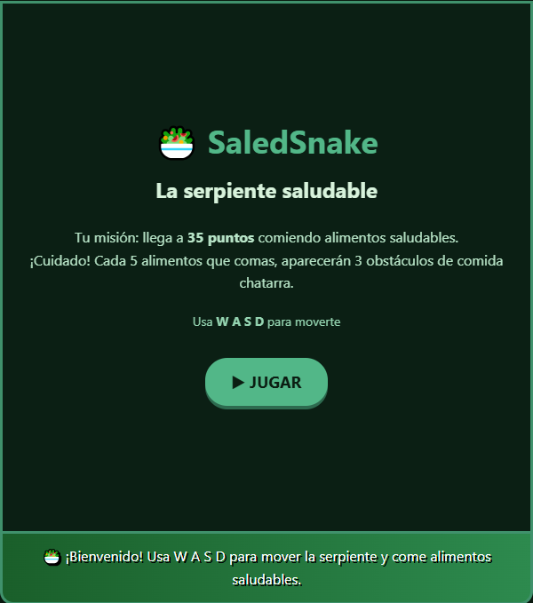

# 🥗 SALEDSNAKE - La Serpiente Saludable

## Descripción

**SaledSnake** es un juego de arcade educativo que combina el clásico juego de la serpiente con enseñanzas sobre alimentación saludable.

### ¿De qué trata?
Controlas una serpiente que debe alimentarse exclusivamente de comida saludable (frutas y verduras) mientras evita la comida chatarra. Cada 5 alimentos saludables que consume, aparecen 3 obstáculos de comida rápida que complican el juego. La serpiente crece y se vuelve más difícil de controlar, pero debes mantenerla alejada de hamburguesas, pizzas, refrescos y otros alimentos poco saludables.

### ¿Cuál es el objetivo del jugador?
Alcanzar **35 puntos** comiendo alimentos saludables (🍎🍌🥕🍇🥑🍅) sin chocar contra:
- Las paredes del área de juego
- El propio cuerpo de la serpiente
- Los obstáculos de comida chatarra (🍔🍕🥤🌭)

El jugador tiene 3 vidas y debe esquivar estratégicamente mientras aprende sobre nutrición.

### ¿Cuál es la mecánica principal?
- **Movimiento continuo**: La serpiente se mueve constantemente en la dirección seleccionada
- **Controles WASD**: W (arriba), A (izquierda), S (abajo), D (derecha)
- **Alimentación saludable**: Cada fruta/verdura comida = 1 punto
- **Obstáculos progresivos**: Cada 5 alimentos saludables, aparecen 3 obstáculos de comida chatarra
- **Sistema de vidas**: 3 vidas, se pierde al chocar contra pared, uno mismo o comida chatarra
- **Mensaje de muerte**: Aparece en la parte superior indicando por qué perdiste la vida
- **Panel educativo**: Mensajes rotativos sobre nutrición y alimentos saludables/no saludables

## Género

**Arcade** / **Educational** / **Snake**

## Controles

| Tecla | Acción |
|-------|--------|
| `W` | Mover hacia arriba ⬆️ |
| `A` | Mover hacia la izquierda ⬅️ |
| `S` | Mover hacia abajo ⬇️ |
| `D` | Mover hacia la derecha ➡️ |

> **Nota:** No puedes regresar en la dirección opuesta inmediatamente (la serpiente no puede retroceder sobre sí misma).

## Capturas de pantalla

### Menú principal

*Pantalla de inicio con instrucciones y objetivo del juego*

### Demo del juego

*Gameplay mostrando la serpiente comiendo alimentos saludables y evitando la chatarra*

### Game Over

*Pantalla final mostrando la puntuación alcanzada*

## Características Técnicas

- **Objetivo**: 35 puntos para ganar
- **Vidas**: 3 vidas con mensaje de advertencia al perder una
- **Alimentos saludables**: 7 tipos diferentes (manzana, plátano, fresa, zanahoria, uva, aguacate, tomate)
- **Comida chatarra**: 6 tipos diferentes (hamburguesa, pizza, dulce, refresco, hot dog, palomitas)
- **Sistema de obstáculos**: 3 obstáculos aparecen cada 5 alimentos consumidos
- **Panel educativo**: 16 mensajes rotativos sobre nutrición y alimentación
- **Velocidad constante**: 150ms por movimiento
- **Grid**: 15x15 celdas (600x600px)

## Alimentos del Juego

### ✅ Saludables (+1 punto)
| Emoji | Alimento | Beneficio |
|-------|----------|-----------|
| 🍎 | Manzana | Energía natural |
| 🍌 | Plátano | Da energía |
| 🍓 | Fresa | Rica en vitamina C |
| 🥕 | Zanahoria | Mejora la vista |
| 🍇 | Uva | Antioxidantes |
| 🥑 | Aguacate | Grasas saludables |
| 🍅 | Tomate | Rico en licopeno |

### ❌ Chatarra (Obstáculos)
| Emoji | Alimento | Por qué evitarlo |
|-------|----------|------------------|
| 🍔 | Hamburguesa | Mucha grasa |
| 🍕 | Pizza | En exceso no es saludable |
| 🍭 | Dulce | Daña los dientes |
| 🥤 | Refresco | Mucha azúcar |
| 🌭 | Hot dog | Mucho sodio |
| 🍿 | Palomitas | Mucha sal |

## Mensajes Educativos

El juego incluye 16 mensajes educativos que rotan cada 6 segundos:
- Beneficios de frutas y verduras
- Advertencias sobre comida chatarra
- Datos nutricionales
- Consejos de alimentación saludable

## Tecnologías

- HTML5 Canvas
- CSS3
- JavaScript (Vanilla)

---

**Desarrollado por:** [@goemon043](https://github.com/goemon043)

*¡Aprende a comer saludable mientras te diviertes!*

---

*🎯 Meta: 35 puntos | ❤️ Vidas: 3 | 🍎 Come sano, evita la chatarra*
