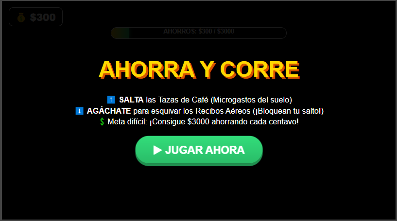
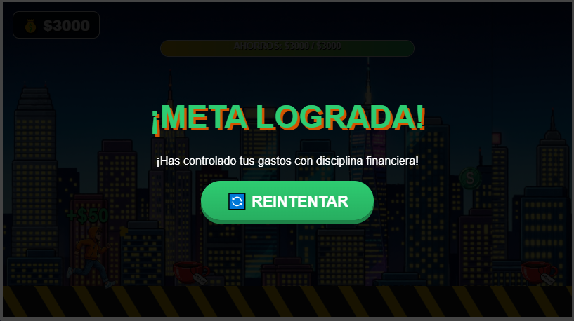
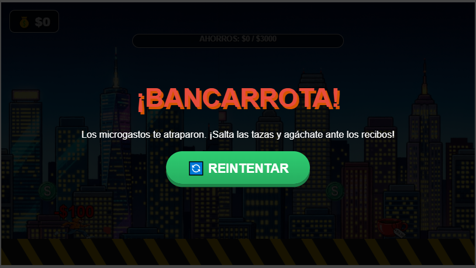

# 🏃 AHORRA Y CORRE - Modo Experto

## Descripción

**Ahorra y Corre** es un juego de carreras infinitas (endless runner) con temática de educación financiera que combina reflejos rápidos con conciencia sobre el ahorro y el control de gastos.

### ¿De qué trata?
Controlas a un personaje que debe correr constantemente mientras esquiva obstáculos que representan gastos innecesarios: tazas de café en el suelo o aire (microgastos diarios). Debes recoger monedas para aumentar tus ahorros mientras esquivas hábilmente los obstáculos que te hacen perder dinero, todo bajo el ritmo motivador del tema de Guile de Street Fighter II.

### ¿Cuál es el objetivo del jugador?
Alcanzar **$3000 en ahorros** partiendo desde un saldo inicial de $300. El jugador debe mantener su saldo por encima de $0, esquivando obstáculos y recogiendo monedas, mientras la velocidad del juego aumenta progresivamente poniendo a prueba sus reflejos y disciplina.

### ¿Cuál es la mecánica principal?
- **Salto (⬆️)**: Esquiva las tazas de café en el suelo (microgastos).
- **Agacharse (⬇️)**: Pasa por debajo de los tazas de café aereas(gastos sorpresa que bloquean tu salto).
- **Recompensa**: +$50 por cada moneda recogida (ahorro consistente).
- **Penalización**: -$100 por cada colisión con un obstáculo (pérdida de ahorros).
- **Dificultad progresiva**: La velocidad del juego aumenta automáticamente cada 500 frames.
- **Condiciones de victoria/derrota**: Ganas al llegar a $3000, pierdes si tu saldo llega a $0.
- **Efectos visuales**: Texto flotante de ganancias/pérdidas, partículas de impacto y "screen shake" (vibración) al chocar.
- **Barra de progreso**: Visualización en tiempo real del avance hacia la meta de $3000.

## Género

**Arcade** / **Runner** / **Educational** / **Endless**

## Controles

| Acción | Método |
|--------|--------|
| **Saltar** | Tecla `⬆️` (Flecha Arriba) |
| **Agacharse** | Tecla `⬇️` (Flecha Abajo) |

> **Nota:** El juego se juega **exclusivamente con teclado**. El timing y los reflejos son cruciales debido al aumento progresivo de la velocidad.

## Capturas de pantalla

### Menú principal
  
*Pantalla de inicio con instrucciones de salto y agacharse*

### Demo del juego
 
*Gameplay mostrando al personaje esquivando obstáculos y recogiendo monedas*

### Victoria
 
*Pantalla de éxito al alcanzar la meta de $3000 en ahorros*

### Derrota / Bancarrota
 
*Pantalla de game over cuando los microgastos reducen el saldo a $0*

## Obstáculos y Recompensas

| Elemento | Tipo | Posición | Acción Requerida | Efecto |
|----------|------|----------|------------------|--------|
| 🪙 **Moneda** | Recompensa | Variable | Tocar | +$50 al saldo |
| ☕ **Taza de café** | Obstáculo | Suelo (Y=410) Aire (Y=300)| Saltar (⬆️) o Agacharse (⬇️)| -$100 al saldo |

## Características Técnicas

- **Física ajustada**: Salto alto con caída rápida para mayor control y precisión.
- **Dificultad dinámica**: La velocidad base (7 px/frame) aumenta +0.5 cada 500 frames.
- **Sistema de colisiones**: Hitboxes con margen de tolerancia (padding) para un juego más justo.
- **Efectos visuales**: 
  - Partículas al recoger monedas o chocar.
  - Texto flotante (+$50 en verde, -$100 en rojo).
  - Efecto de vibración (screen shake) al recibir daño.
  - Fondo con desplazamiento infinito (parallax).
- **Audio**: Música de fondo (Guile's Theme) con volumen controlado al 30%.
- **Fallback visual**: Si las imágenes no cargan, el juego dibuja formas temáticas (café, recibos, monedas) usando Canvas API.

## Sistema de Puntuación

| Acción | Puntos | Efecto Visual |
|--------|--------|---------------|
| Recoger moneda | +$50 | Texto verde "+$50" + partículas doradas |
| Chocar con obstáculo | -$100 | Texto rojo "-$100" + vibración de pantalla |
| Alcanzar meta ($3000) | Victoria | Pantalla de éxito verde |
| Saldo llega a $0 | Derrota | Pantalla de "Bancarrota" roja |

## Tecnologías

- HTML5 Canvas
- CSS3 (con gradientes y animaciones)
- JavaScript (Vanilla)
- Web Audio API (música de fondo)

---

**Desarrollado por:** [@goemon043](https://github.com/goemon043)

**Música:** Guile's Theme - Street Fighter II

*¡Aprende a ahorrar mientras corres contra el tiempo!*

---

### 💰 Mensaje Educativo

El juego enseña conceptos importantes de finanzas personales:
- **Microgastos**: Las pequeñas compras diarias (como el café) se acumulan y afectan tu saldo.
- **Gastos sorpresa**: Los recibos inesperados pueden bloquear tu progreso financiero.
- **Ahorro consistente**: Cada moneda cuenta para alcanzar tu meta a largo plazo.
- **Disciplina**: Requiere constancia, atención y evitar tentaciones en el camino.

---

*🎯 Meta: $3000 | 💵 Inicio: $300 | ⚡ Velocidad: Progresiva | 🎵 Música: Guile's Theme*
